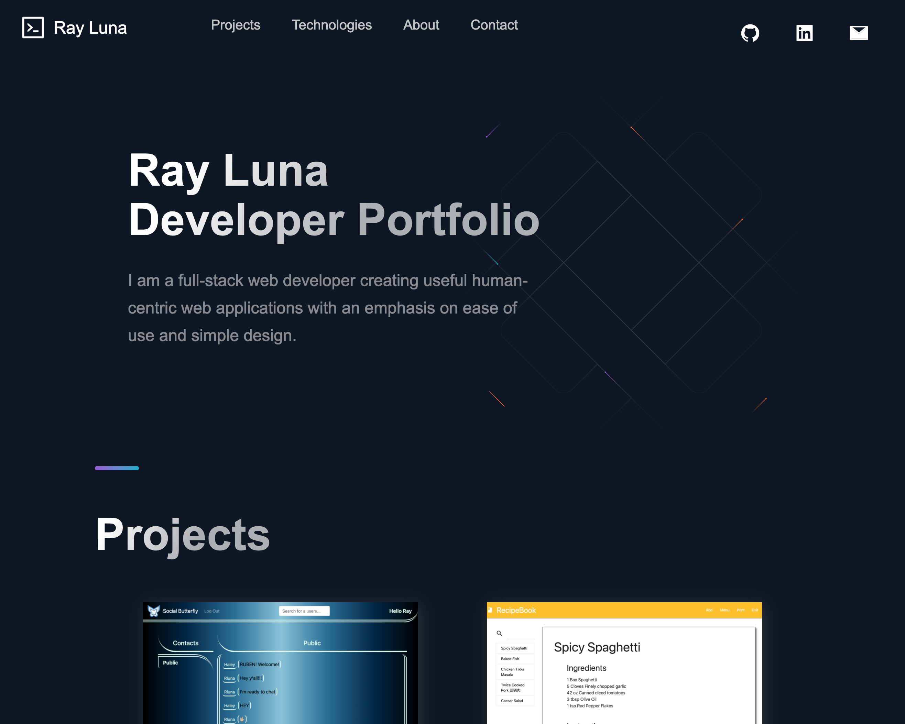

# Developer Portfolio

## Description

This is my current web developer portfolio built with React.js and Next.js. The app is deployed via Netlify. This is a one page layout that includes a collection of my best projects, tech skills, a bio and contact information with content coming from Contentful CMS API and static rendering with Next.js.

### Project URLs
- [https://www.rayluna.me/](https://www.rayluna.me/)
- [https://nextjs-portfolio-rldev.netlify.app/](https://nextjs-portfolio-rldev.netlify.app/)

## Table of Contents

- [Image](#image)
- [Technologies](#technologies)
- [Known-Bugs](#known-bugs)
- [Next-Steps](#next-steps)
- [License](#license)
- [Contact](#contact)
- [Links](#links)

## Image

## Technologies

- React.js
- Next.js
- Contentful
- Netlify
- Javascript
- Font Awesome
- React-Icons

## Known-Bugs

Minor styling bugs on smaller screens.

## Next-Steps

- Styling updates for mobile view
- Add form to contact section

## License

This project is licensed under the [MIT](https://opensource.org/licenses/MIT) license.

## Contact

Author: Ray Luna

If you have any questions about the repo, open an issue or contact me directly at:

- E-Mail: leon.luna.ray@gmail.com
- GitHub: [leon-luna-ray](https://github.com/leon-luna-ray)

## Links

- [Deployed Project](https://rluna-dev-portfolio.netlify.app/)

- [Project Repository](https://github.com/leon-luna-ray/readme-generator)
